# Session 4 - Views
 With all those features packed into session 3 blogspot, Now Introducing the all new session 4 BlogSpot!!
 
 > *__"People Always judge the book by its cover"__.<br>*
 >   *-GoodBoy*
 
 So with that said let's see one of the *__covers__* for BlogSpot.

# Features

The new features which were been added to BlogSpot were:
 * Live Toast Message (__AJAX__)
 * Image Upload for atricles (__Active Storage__)
 * Pagination (__Pagy__)
 * PDF download (__wicked_pdf__)
 * BootStrap Alerts
 * Integrated Bootstrap framework
 
# Opening a new session

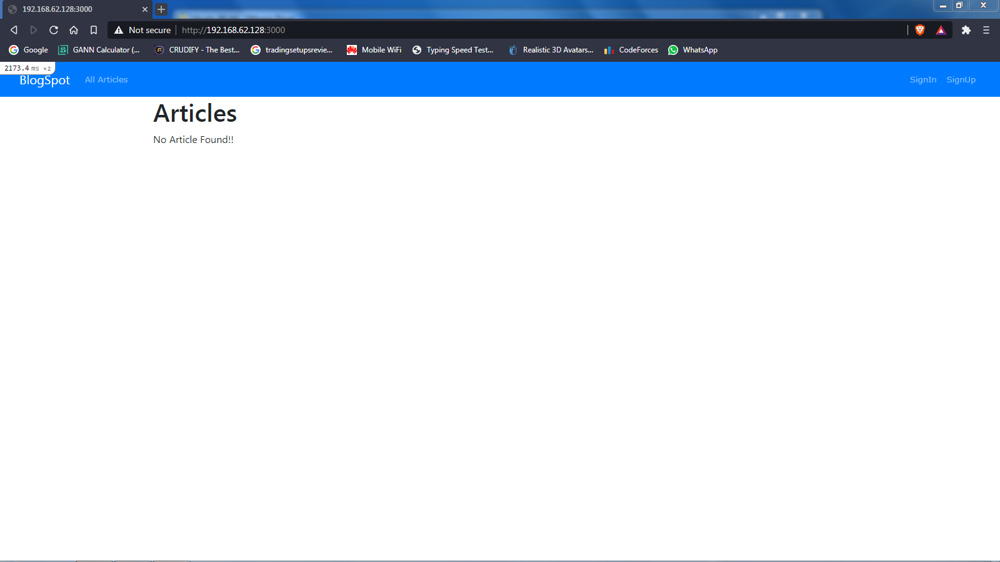

# Creating a New User

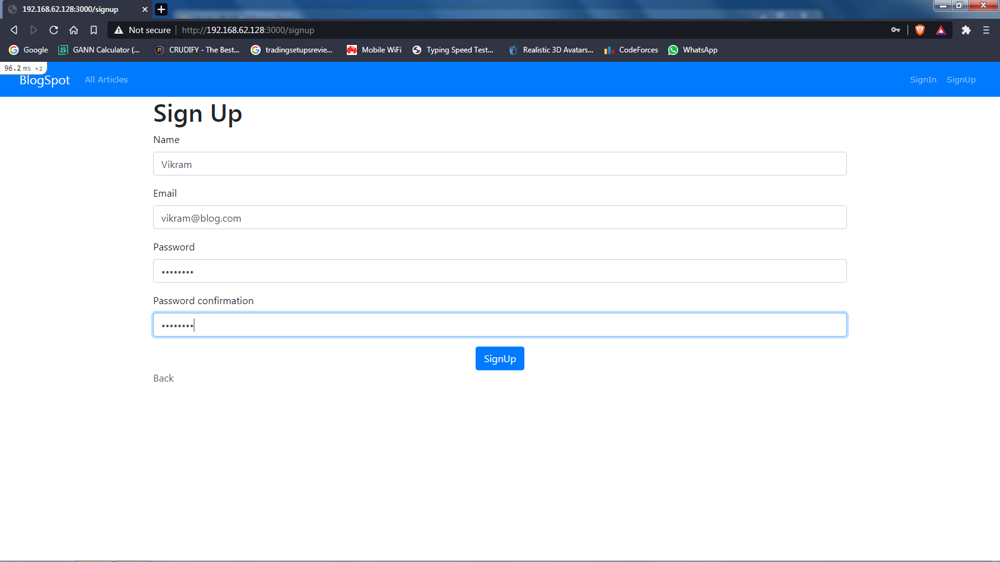 

# LogIn to the created User

 Used bootstrap `Alerts` to display `:notice` and `:alerts`.
 
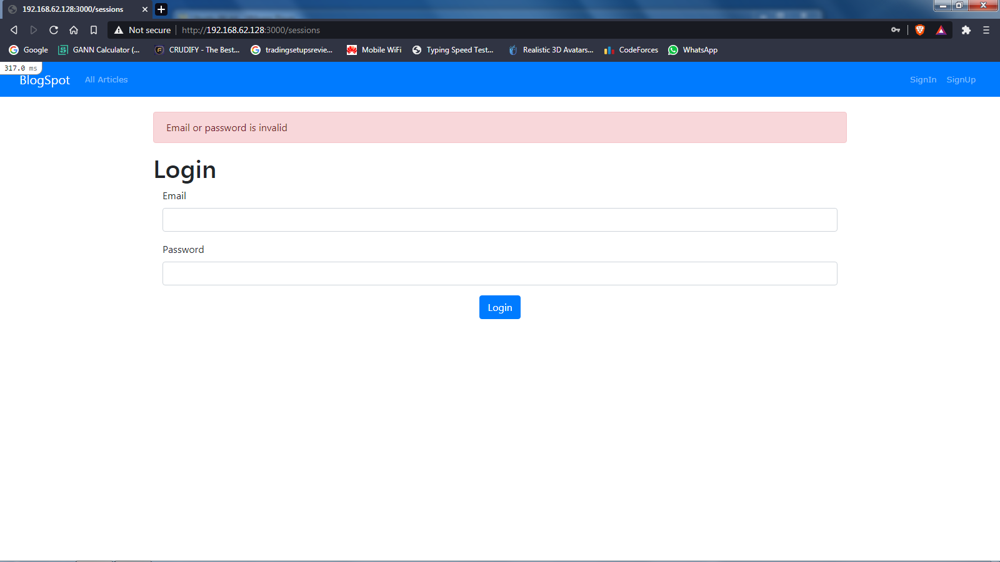

LoggedIn to the new User

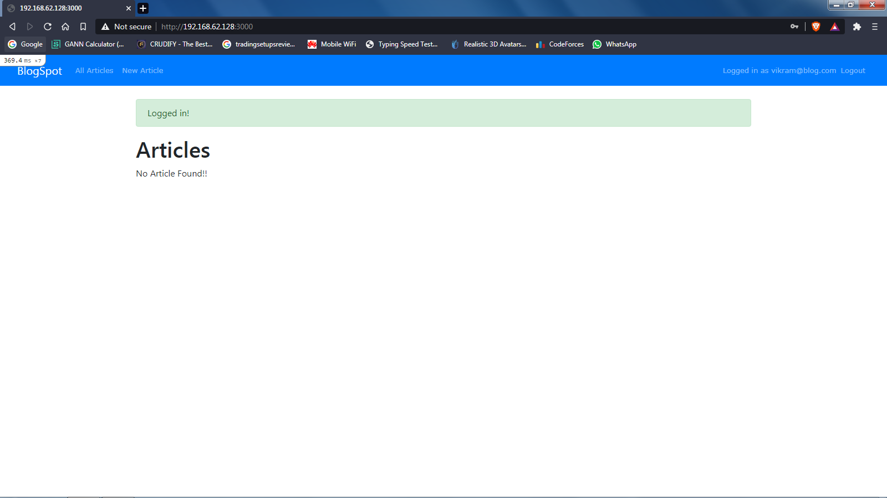

# Creating a public article

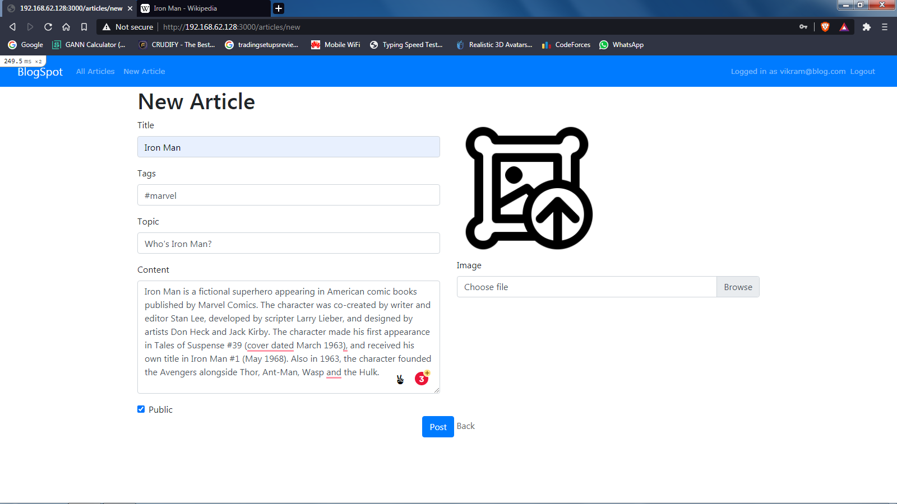

With the facility of `Active Storage`, able to store images from user local

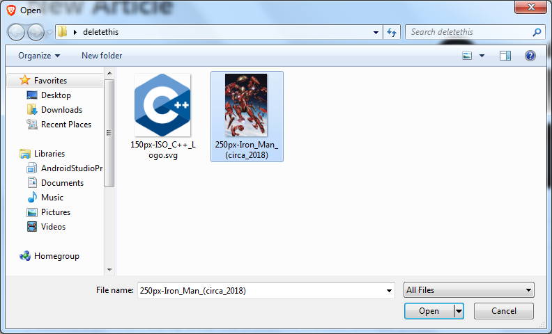

With the establishment of `one to one` relation with active records and articles, able to archive image storing to prior articles
```ruby
  class Article < ApplicationRecord
    has_one_attached :image
  end
```

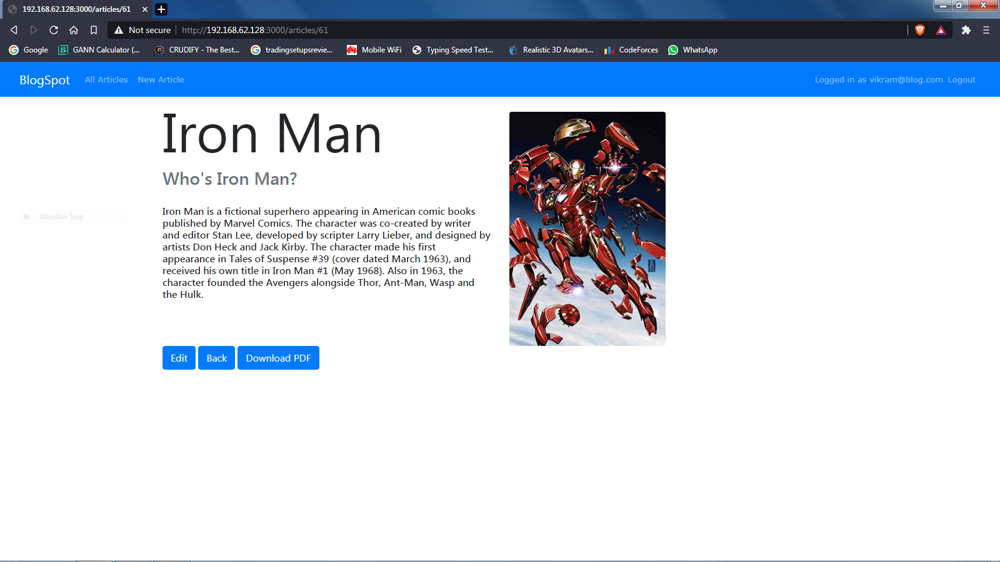

Also with the help of `wicked_pdf` gem, downloadable pdf can be generated using html. Those htmls can be rendered from partials, layouts and other formats.
```ruby
  respond_to do |format|
          format.html
          format.pdf do
            render pdf: "Article No. #{@article.id}",
            page_size: 'A4',
            template: "articles/show.html.erb",
            layout: "pdf.html.erb",
            orientation: "Portrait",
            zoom: 1,
            dpi: 72
        end
```

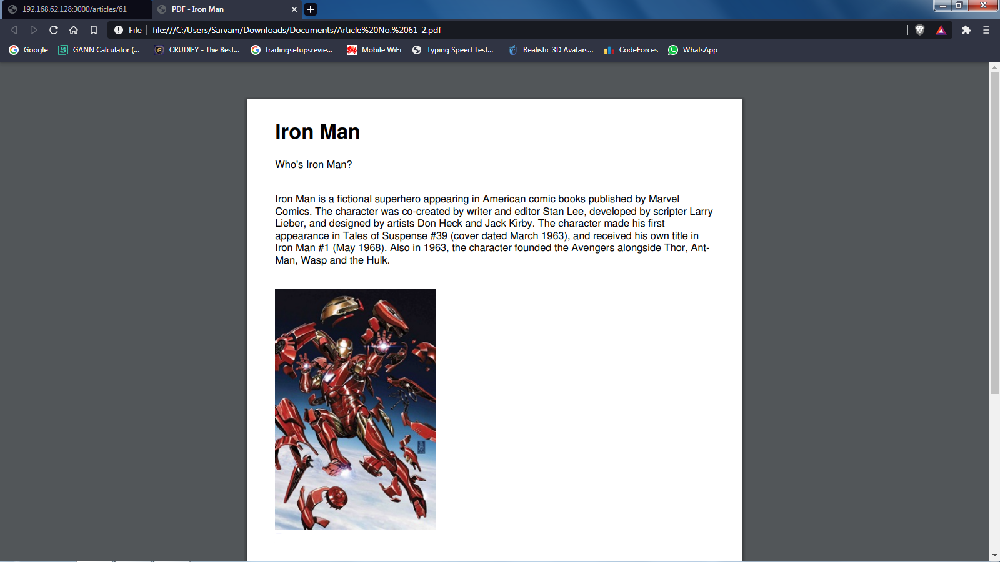

# Index or root page

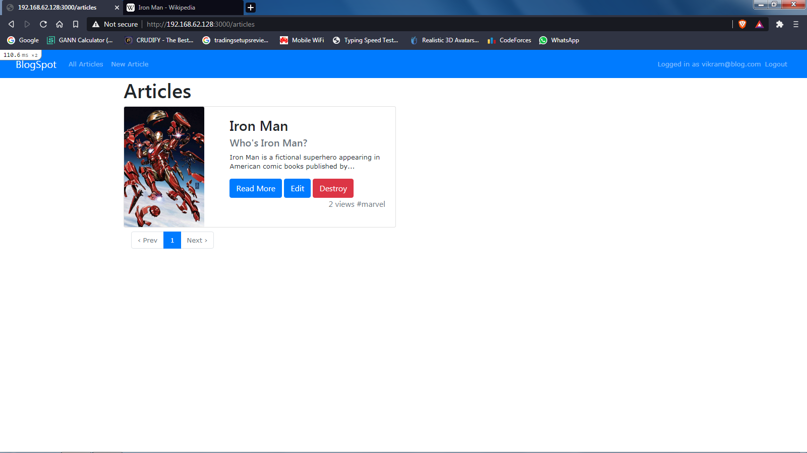

Here as seen, bootstrap `cards` are been used to dispaly the indices

On the index page we have couple more other features

First,

BootStrap Pagination using `pagy` gem https://github.com/ddnexus/pagy. This gem runs `AJAX` request over the server and updates the page with atmost four articles (shown later).
This gem was been selected as they claim this to be highly effient and executes faster than others paginaton gems. 

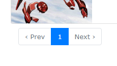

The Pagy is setup on the `ArticlesController` as show below

```ruby
  class ArticlesController < ApplicationController
  .
  .
  include Pagy::Backend
  .
  .
  def show
   @pagy, @articles = pagy(Article.order("views DESC").all)
   .
   .
  end
  
```

Also this needs to be meantion inside `ArticlesHelper` module

```ruby
  module ArticlesHelper
    include Pagy::Frontend
  end
```

And inside `articles\index.html.erb` we use these variables as shown also with integration with bootstrap pagination we have everyhing on track

```erb
  <%#Normal articles loops%>
  <% @articles.each do |article| %>
   .
   .
  <% end %>
  .
  .
  <%#Those "==" is same as "= raw pagy_bootstrap_nav(@pagy).html_safe"%>
  <%== pagy_bootstrap_nav(@pagy).html_safe%>
```

The other Feature is to count the number of views, also this field is useful in sorting the article (shown later)

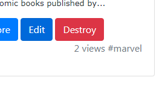

These views gets added up once the blog is been visited(show)

``` ruby
 def show
 ..
  if @article.views
        views = @article.views + 1
        @article.views = views
      else
        @article.views = 1
  end
  ..
 end
```

# Adding Several Posts
 Now to demonstrate Pagination feature and sorting, 3 more new articles are been added
 
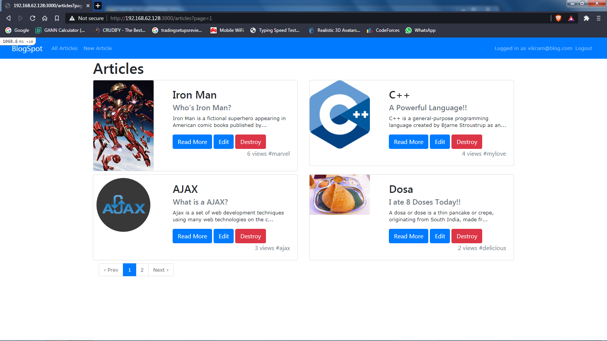

 As seen in these two image the articles are been arranged in decending order
 
 ``` ruby
    Article.order("views DESC").all
 ```
Also this Pagy gem uses `AJAX` request which present the indices to users without any reload, this makes the browsing experience more smoother.

# Live Toast Message
 Now seen is a ground breaking, more over head breaking feature. This gave users the feature to recive a toast when ever a new blog has been posted.
 So decided to implement this feature without using any gem.
 
 Making a new sesion
 
 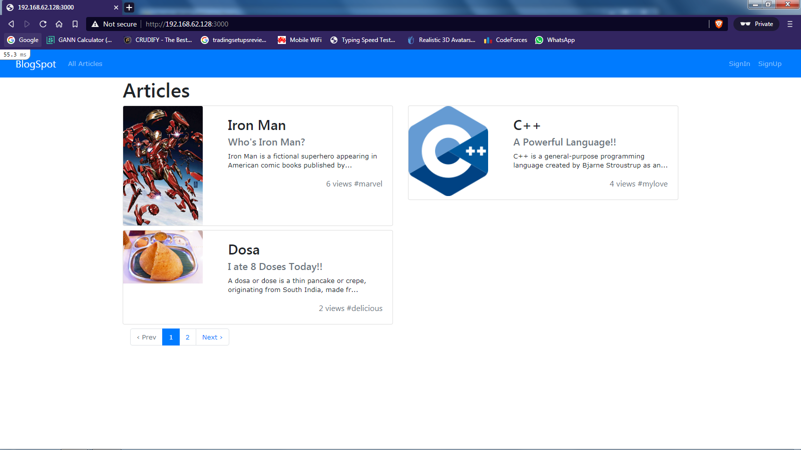
 
 LoggingIn to a Test User
 
 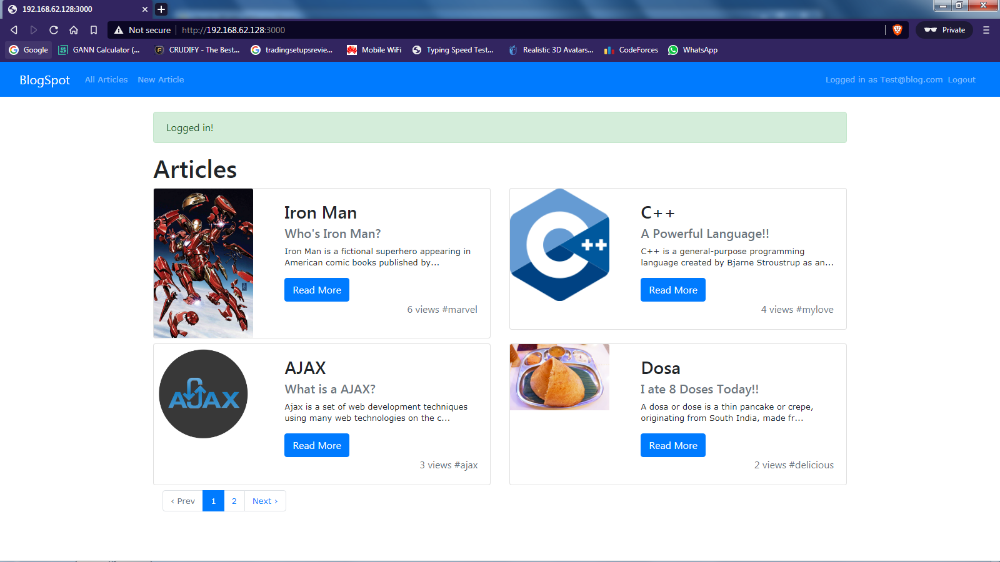
 
 Making an Article
 
 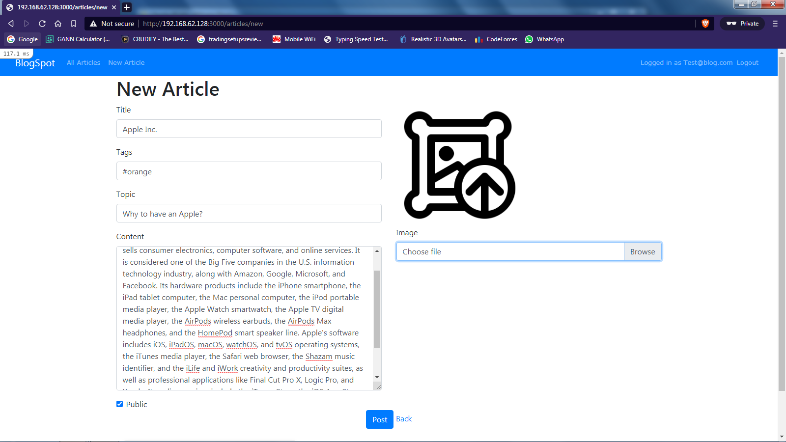
 
 After Publishing, within a second there will be a toast message to others with prior fields.
 
 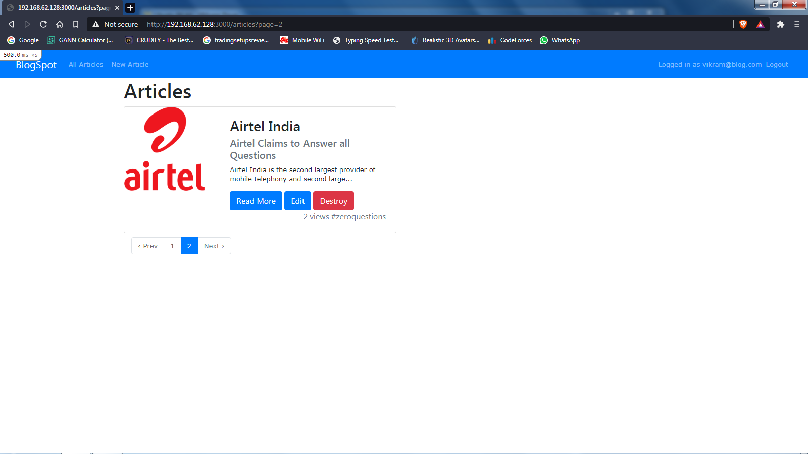 
 
 The screen for the Test User without any popup which is been noted, also there exists a problem which couldn't Figured Out! To update the index page when new article added.
 This is because of the gem usage, also those index get updated from the partial by the gem. But anyways the users recieve popup messages.
 
 
 
 So now lets see who is get implemented. First to get a regular update from the rails server. For this to happen we need a simple get server to run from client(user) side.
 Implementation is simple we run a javascript which run `GET` requests over a special route(explained later), this route in turn return a data in `JSON`. Also to be noted
 this request runs `AJAX` so the page wont get refreshed.
 
 ``` javascript
   $(document).ready(function()
   {
     setInterval(function()
     {
       $.ajax(
       {
         url: "http://192.168.62.128:3000/newarticle/" + out,
         type: "get",
         success: function(result)
         {
           //toast popup code
         });
       });
     }, 1000);
   });
 ```
 
 Route Defenition of `newarticle`
 
 ```ruby
   Rails.application.routes.draw do
     .
     .
     get 'newarticle/:id', to: 'application#ajax'
   end
 ```
 
 Controller Defenition in `application_controller.rb`
 
 ```ruby
   def ajax
      #verifies user has been logged in
      if session[:user_id]
        data = $new_article
        viewed = session[:notified_new_article]
        
        #verifies that requested user is not created user
        if data && data.user_id != params[:id].to_i
        
         #verifies that same data is not send at the next get
          if viewed != data.id || viewed != nil
            session[:notified_new_article] = $new_article.id
            render json: {#..json data..}
          end
        else
          render json: {#..no data..}
        end
      end
    end
 ```
 
 With all these set the popup works fine as expected
 
 Tnx!!
